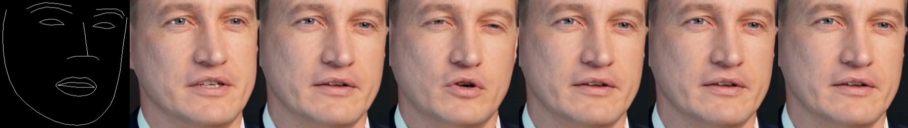
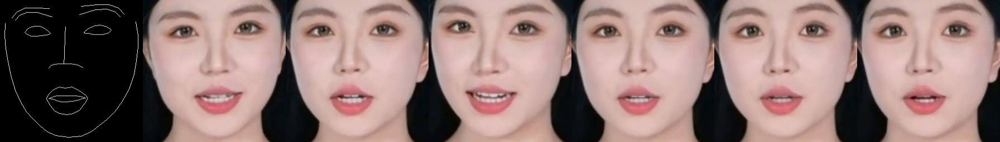
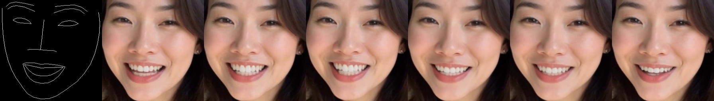
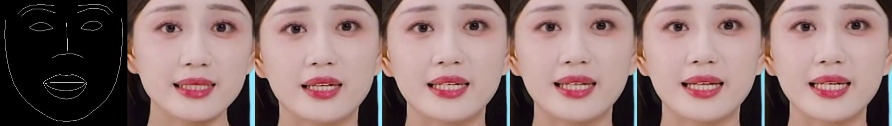

# IP_LAP_256 is ours LangXin_V2 Commercial code, mainly used for 2024. Because we have better models now, So we open sourced it. Facilitating everyone's learning and research.
# 一个可以还原本人牙齿和嘴型的商用泛化数字人项目。
# 推理视频需要开口说话，可以数数1、2、3、4..... 也可以随便说。
This is a project about talking faces. It is a commercial digital human project that faithfully reproduces human faces, mouths, and teeth.We use 256X256 sized facial images for training, Because his face is cut from the forehead, the face size of 256X256 is equivalent to the face size of wav2lip384. So it can generate 720p, 1080p, 2k ,4k Digital Humanhuman videos. 
This model innovatively uses attention mechanism, which can reference the mouth shape of the face in the previous and subsequent frames to generate new mouth shapes. Thus achieving the restoration of one's own teeth and mouth shape.
IP_LAP use a network structure of 128x128  , IP_LAP_256 use a network structure of 256x256.
We have done the following work:
1. Add video cutting codes.
2. Optimized the network structure and increased the clarity of face segmentation.
3. Trained 1000 people, 50 hours dataset, and over 50000 pieces of data.
4. Dear friends, we no released the best landmark  checkpoint, you need load pre training weights for easy subsequent training. but we released the best renderer checkpoint ,you can use it directly.
5. Of course, you can also use a 1-minute video for fine-tuning training to achieve better commercial results.
6. If you want to achieve better reasoning results, then refer to my demo video for shooting.

## 🏗️ IP_LAP_256 Project situation

  <b>
    <a href="https://www.bilibili.com/video/BV1xi53zbELH/?spm_id_from=333.1387.upload.video_card.click">Video </a>
    | 
    <a href="https://github.com/langzizhixin">Project Page</a>
    |
    <a href="https://github.com/langzizhixin/IP_LAP_256">Code</a> 
  </b>

 

checkpoints for LangXin_V2 (IP_LAP_256)   https://pan.baidu.com/s/1NiSEdrlRVZM_6SD4Igdtlg?pwd=lzzx 

## 📊 The following pictures are comparison images of the training generator training 200000 steps.
## 📊 The second to last image is the generated digital human image.

  
    
    
    
    
  
## 📊 The following pictures are comparison images of the training generator training 300000 steps.
## 📊 The second to last image is the generated digital human image.

  
    
    
    
    

## 🎬 Demo

<table class="center">
  <tr style="font-weight: bolder;text-align:center;">
        <td width="34.4%"><b>Original video</b></td>
        <td width="65.6%"><b>Lip-synced video</b></td>
  </tr>
  <tr>
    <td>
      <video src=https://github.com/user-attachments/assets/2a33a948-e241-4064-a39a-93e90deecdac controls preload></video>
    </td>
    <td>
      <video src=https://github.com/user-attachments/assets/69c9ba4f-5d8b-4abb-badf-a4b6c52acf71 controls preload></video>
    </td>
  </tr>
  <tr>
    <td>
      <video src=https://github.com/user-attachments/assets/c1228614-ff01-469b-ae83-a612ce19e70f controls preload></video>
    </td>
    <td>
      <video src=https://github.com/user-attachments/assets/322688b8-f1ac-47d4-9094-5b9b66064c06 controls preload></video>
    </td>
  </tr>
  <tr>
    <td>
      <video src=https://github.com/user-attachments/assets/e1a1e074-1461-4848-8511-c79d875f8bee controls preload></video>
    </td>
    <td>
      <video src=https://github.com/user-attachments/assets/7eba86fa-69fb-4496-9eaa-41d509cb9123 controls preload></video>
    </td>
  </tr>
  <tr>
    <td width=600px>
      <video src=https://github.com/user-attachments/assets/8e5f6a2a-9df8-489d-bcc4-8b58ded659cf controls preload></video>
    </td>
    <td width=600px>
      <video src=https://github.com/user-attachments/assets/5a66a980-2e3f-4a47-9722-4aec034477e2 controls preload></video>
    </td>
  </tr>
  <tr>
</table>

## 📑 Open-source Plan
For digital human projects , we will continue to train and release higher definition weights in the future.
The plan is as follows:
Pre training checkpoints for wav2lip_288x288 (LangXin_V0) will be released in January 2025.
Pre training checkpoints for wav2lip_384x384 (LangXin_V1) will be released in February 2025.
Pre training checkpoints for IP_LAP_256 (LangXin_V2) will be released after June 2025.
Pre training checkpoints for  (LangXin_V3) will be released after June 2026.
- [x] landmark_checkpoints  
- [x] renderer_checkpionts
- [x] Dataset processing pipeline
- [x] Training method
- [x] Inference
- [ ] Real time Inference 
- [ ] Higher definition commercial checkpoints

## 🙏  Citing
Thank you to the other three authors, Thank you for their wonderful work.
https://github.com/Weizhi-Zhong/IP_LAP

## 📖 Disclaimers
This repositories made by langzizhixin from Langzizhixin Technology company 2025.7.20 , in Chengdu, China .
The above code and weights can only be used for personal/research/non-commercial purposes.
Especially for digital human video models in the warehouse, if commercial use is required, please contact the model themselves for authorization.
If you need a higher definition model, please contact us by email 277504483@qq.com, ajian.justdoit@gmail.com or add ours WeChat for communication: langzizhixinkeji 
