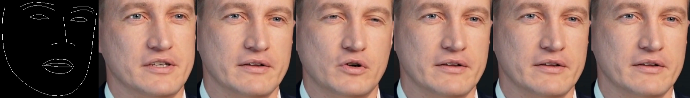

# IP_LAP_256 is ours LangXin_V2 Commercial code, mainly used for 2024. Because we have better models now, So we open sourced it. Facilitating everyone's learning and research.
# 一个可以超保真还原本人牙齿和嘴型的商用泛化数字人项目。
# 推理视频需要开口说话，可以数数1、2、3、4..... 也可以随便说。
## Performance Benchmark
| Capability | LangQing |
|---|---|
| Fast Response Latency | <500ms |
| Normal Conversation Latency | ~1.5s |
| Lip Sync Similarity | Up to 96% |
| Realtime Gesture Sync | Yes |
| Seamless Video Switching | Yes |
| CPU Realtime Inference | Supported |
| GPU Concurrent Sessions | 4~6 streams on RTX 3060 |
| WebRTC | Supported |
| Local Deployment | Supported |
| Cloud Deployment | Supported |
| Multi-language | Supported |
| RAG Workflow | Supported |
| AI Agent Integration | Supported |

## 🏗️ IP_LAP_256 Project situation

  <b>
    <a href="https://www.bilibili.com/video/BV1fyhczFEuB/?vd_source=7720ff9e037156b51374d14ee8f76b51">Video </a>
    | 
    <a href="https://github.com/langzizhixin">Project Page</a>
    |
    <a href="https://github.com/langzizhixin/IP_LAP_256">Code</a> 
  </b>

 

checkpoints for LangXin_V2 (IP_LAP_256)   https://pan.baidu.com/s/1lzqgqO6vkFxa2-0AiS4a1A?pwd=lzzx

## 📊 Sample of processed images.

  
    
    
  
## 📊 The following pictures are comparison images of the training generator training 200000 steps, The second to last image is the generated digital human image.

  
    
    
    
    
  
## 📊 The following pictures are comparison images of the training generator training 300000 steps, The second to last image is the generated digital human image.

  
    
    
    
    

## 🎬 Demo

<table class="center">
  <tr style="font-weight: bolder;text-align:center;">
        <td width="34.4%"><b>Original video</b></td>
        <td width="65.6%"><b>Lip-synced video</b></td>
  </tr>
  <tr>
    <td>
      <video src=https://github.com/user-attachments/assets/2a33a948-e241-4064-a39a-93e90deecdac controls preload></video>
    </td>
    <td>
      <video src=https://github.com/user-attachments/assets/69c9ba4f-5d8b-4abb-badf-a4b6c52acf71 controls preload></video>
    </td>
  </tr>
  <tr>
    <td>
      <video src=https://github.com/user-attachments/assets/ecba6a6b-9d52-40a5-92f1-6c29a5cb8a7a controls preload></video>
    </td>
    <td>
      <video src=https://github.com/user-attachments/assets/cb0712ff-026e-45d9-87af-f95434c6ae60 controls preload></video>
    </td>
  </tr>
  <tr>
    <td>
      <video src=https://github.com/user-attachments/assets/73026e3a-b3cf-47d9-9d27-50a94dcceb78 controls preload></video>
    </td>
    <td>
      <video src=https://github.com/user-attachments/assets/520548fb-782f-4fed-9603-c6861a8b70ab controls preload></video>
    </td>
  </tr>
  <tr>
    <td width=600px>
      <video src=https://github.com/user-attachments/assets/d533df8d-381c-492b-bea1-d23de37e20c6 controls preload></video>
    </td>
    <td width=600px>
      <video src=https://github.com/user-attachments/assets/31622741-077e-45f8-a01e-785d89f1113b controls preload></video>
    </td>
  </tr>
  <tr>
</table>

## 📑 Open-source Plan
For digital human projects , we will continue to train and release higher definition weights in the future.
The plan is as follows:
Pre training checkpoints for wav2lip_288x288 (LangXin_V0) will be released in January 2025.
Pre training checkpoints for wav2lip_384x384 (LangXin_V1) will be released in February 2025.
Pre training checkpoints for IP_LAP_256 (LangXin_V2) will be released after June 2025.
Pre training checkpoints for  (LangXin_V3) will be released after June 2026.
- [x] landmark_checkpoints  
- [x] renderer_checkpionts
- [x] Dataset processing pipeline
- [x] Training method
- [x] Inference
- [ ] Real time Inference 
- [ ] Higher definition commercial checkpoints

## 🙏  Citing
Thank you to the other three authors, Thank you for their wonderful work.
https://github.com/Weizhi-Zhong/IP_LAP

## 📖 Disclaimers
This repositories made by langzizhixin from Langzizhixin Technology company 2025.7.20 , in Chengdu, China .
The above code and weights can only be used for personal/research/non-commercial purposes.
Especially for digital human video models in the warehouse, if commercial use is required, please contact the model themselves for authorization.
If you need a higher definition model, please contact us by email 277504483@qq.com, ajian.justdoit@gmail.com or add ours WeChat for communication: langzizhixinkeji 
